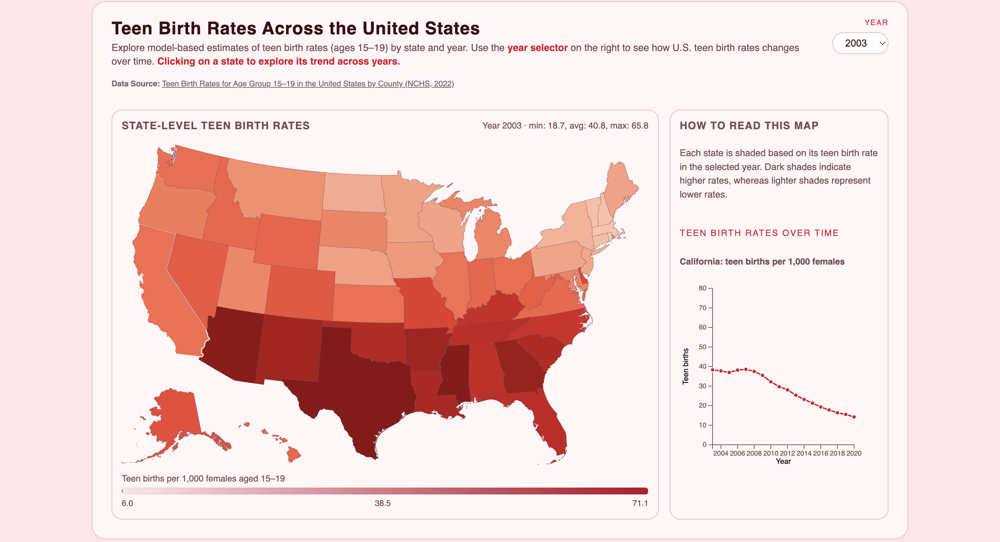

# Teen Birth Rates Across the United States

Yufei Mao

## Description

This project visualizes changes in U.S. teen birth rates through two coordinated interactive views. A choropleth map displays state-level teen birth rates for any selected year, with a year selector allowing users to explore data from 2003 to 2020. States are shaded along a continuous color scale, where darker tones represent higher rates. When a user clicks on a state, a linked line chart appears on the right panel, showing that state’s teen birth-rate trends over time. Together, the map and line chart enable viewers to compare spatial patterns and temporal changes, offering a comprehensive view of how teen birth rates vary across states and evolve across years.

## Data Sources

### Data Source 1: Teen Birth Rates for Age Group 15-19 in the United States by County (NCHS, 2022)

URL: https://catalog.data.gov/dataset/nchs-teen-birth-rates-for-age-group-15-19-in-the-united-states-by-county
